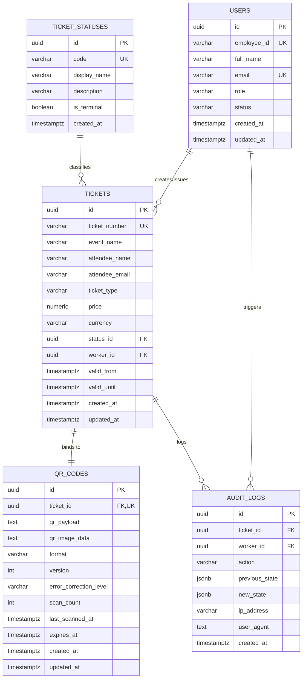

# Database Architecture Specification

## Project: Ticket QR Code Generator Worker
**Ticket ID**: ENG-139055  
**Epic**: Core Infrastructure Overhaul  
**Status**: Definitive Architectural Draft  

---

## 1. Architectural Purpose & Overview

The client is transitioning from manual, error-prone paper logs and Excel spreadsheets to an enterprise-grade digital **Ticket QR Code Generator Worker**. The database architecture must guarantee:
- Deterministic ticket identification and tracking.
- Cryptographically sound or tamper-evident QR code mapping.
- Clear worker accountability and ownership attribution.
- Immutable audit trails for status transitions, generations, and check-in events.
- Strict data integrity constraints with high-throughput index coverage.

This schema is designed targeting PostgreSQL 15+ / standard enterprise relational databases, adhering to 3NF normalization principles.

---

## 2. Entity Relationship Diagram (ERD)

---

## 3. Entity & Table Definitions

### 3.1 `users` (Workers / Managers / Administrators)
Stores worker identities, internal employee IDs, and privilege levels.

| Column | Data Type | Nullable | Default | Constraints / Description |
| :--- | :--- | :--- | :--- | :--- |
| `id` | `UUID` | No | `gen_random_uuid()` | Primary Key |
| `employee_id` | `VARCHAR(50)` | No | None | Unique corporate worker identifier (e.g. `EMP-9021`) |
| `full_name` | `VARCHAR(150)` | No | None | Worker's full legal/display name |
| `email` | `VARCHAR(255)` | No | None | Unique corporate email address |
| `role` | `VARCHAR(50)` | No | `'WORKER'` | Role: `'WORKER'`, `'MANAGER'`, `'ADMIN'` |
| `status` | `VARCHAR(20)` | No | `'ACTIVE'` | Account status: `'ACTIVE'`, `'SUSPENDED'`, `'INACTIVE'` |
| `created_at` | `TIMESTAMPTZ` | No | `CURRENT_TIMESTAMP` | Row creation timestamp |
| `updated_at` | `TIMESTAMPTZ` | No | `CURRENT_TIMESTAMP` | Last updated timestamp |

**Indexes & Constraints**:
- `pk_users`: `PRIMARY KEY (id)`
- `uq_users_employee_id`: `UNIQUE (employee_id)`
- `uq_users_email`: `UNIQUE (email)`
- `chk_users_role`: `CHECK (role IN ('WORKER', 'MANAGER', 'ADMIN'))`
- `chk_users_status`: `CHECK (status IN ('ACTIVE', 'SUSPENDED', 'INACTIVE'))`

---

### 3.2 `ticket_statuses` (State Machine Dictionary)
Defines standardized life-cycle states for tickets to prevent rogue status strings.

| Column | Data Type | Nullable | Default | Constraints / Description |
| :--- | :--- | :--- | :--- | :--- |
| `id` | `UUID` | No | `gen_random_uuid()` | Primary Key |
| `code` | `VARCHAR(30)` | No | None | Unique machine-readable code (e.g., `'DRAFT'`, `'ISSUED'`, `'CHECKED_IN'`, `'CANCELLED'`, `'EXPIRED'`) |
| `display_name` | `VARCHAR(50)` | No | None | Human-readable label (e.g., `'Issued & Valid'`) |
| `description` | `VARCHAR(255)` | Yes | NULL | Documentation on when this status applies |
| `is_terminal` | `BOOLEAN` | No | `FALSE` | Flag indicating if tickets in this state can no longer mutate |
| `created_at` | `TIMESTAMPTZ` | No | `CURRENT_TIMESTAMP` | Row creation timestamp |

**Indexes & Constraints**:
- `pk_ticket_statuses`: `PRIMARY KEY (id)`
- `uq_ticket_statuses_code`: `UNIQUE (code)`

---

### 3.3 `tickets` (Core Ticket Entity)
Primary business record representing an event pass or admission token.

| Column | Data Type | Nullable | Default | Constraints / Description |
| :--- | :--- | :--- | :--- | :--- |
| `id` | `UUID` | No | `gen_random_uuid()` | Primary Key |
| `ticket_number` | `VARCHAR(50)` | No | None | Human-readable unique ticket reference (e.g., `TCK-2026-X8921`) |
| `event_name` | `VARCHAR(255)` | No | None | Name of the event / function |
| `attendee_name` | `VARCHAR(150)` | No | None | Ticket holder's full name |
| `attendee_email` | `VARCHAR(255)` | No | None | Ticket holder's contact email |
| `ticket_type` | `VARCHAR(50)` | No | `'GENERAL'` | Classification (e.g., `'VIP'`, `'GENERAL'`, `'STAFF'`) |
| `price` | `NUMERIC(10, 2)`| No | `0.00` | Face value of the ticket |
| `currency` | `VARCHAR(3)` | No | `'USD'` | ISO 4217 Currency Code (3 uppercase letters) |
| `status_id` | `UUID` | No | None | Foreign key referencing `ticket_statuses(id)` |
| `worker_id` | `UUID` | No | None | Foreign key referencing `users(id)` (Creator worker) |
| `valid_from` | `TIMESTAMPTZ` | No | None | Start time for ticket validity |
| `valid_until` | `TIMESTAMPTZ` | No | None | Expiration time for ticket validity |
| `created_at` | `TIMESTAMPTZ` | No | `CURRENT_TIMESTAMP` | Row creation timestamp |
| `updated_at` | `TIMESTAMPTZ` | No | `CURRENT_TIMESTAMP` | Last updated timestamp |

**Indexes & Constraints**:
- `pk_tickets`: `PRIMARY KEY (id)`
- `uq_tickets_ticket_number`: `UNIQUE (ticket_number)`
- `fk_tickets_status`: `FOREIGN KEY (status_id) REFERENCES ticket_statuses(id) ON DELETE RESTRICT`
- `fk_tickets_worker`: `FOREIGN KEY (worker_id) REFERENCES users(id) ON DELETE RESTRICT`
- `chk_tickets_validity_window`: `CHECK (valid_until >= valid_from)`
- `chk_tickets_price_non_negative`: `CHECK (price >= 0.00)`
- `idx_tickets_attendee_email`: `CREATE INDEX idx_tickets_attendee_email ON tickets (attendee_email)`
- `idx_tickets_worker_id`: `CREATE INDEX idx_tickets_worker_id ON tickets (worker_id)`
- `idx_tickets_status_id`: `CREATE INDEX idx_tickets_status_id ON tickets (status_id)`
- `idx_tickets_created_at`: `CREATE INDEX idx_tickets_created_at ON tickets (created_at DESC)`

---

### 3.4 `qr_codes` (QR Artifacts & Verification Payloads)
Stores cryptographic/signed payloads, scan metrics, and rendered QR metadata.

| Column | Data Type | Nullable | Default | Constraints / Description |
| :--- | :--- | :--- | :--- | :--- |
| `id` | `UUID` | No | `gen_random_uuid()` | Primary Key |
| `ticket_id` | `UUID` | No | None | Foreign Key referencing `tickets(id)` (Strict 1-to-1) |
| `qr_payload` | `TEXT` | No | None | Signed token or structured payload (e.g. `JWT` / HMAC digest) |
| `qr_image_data` | `TEXT` | Yes | NULL | Scalable SVG or base64 raster artifact cache |
| `format` | `VARCHAR(10)` | No | `'SVG'` | Format: `'SVG'`, `'PNG'` |
| `version` | `INT` | No | `4` | QR Matrix version (1 - 40) |
| `error_correction_level` | `VARCHAR(2)` | No | `'M'` | ECC level: `'L'`, `'M'`, `'Q'`, `'H'` |
| `scan_count` | `INT` | No | `0` | Number of times scanned |
| `last_scanned_at` | `TIMESTAMPTZ` | Yes | NULL | Timestamp of last scan event |
| `expires_at` | `TIMESTAMPTZ` | No | None | Cryptographic payload expiration timestamp |
| `created_at` | `TIMESTAMPTZ` | No | `CURRENT_TIMESTAMP` | Row creation timestamp |
| `updated_at` | `TIMESTAMPTZ` | No | `CURRENT_TIMESTAMP` | Last updated timestamp |

**Indexes & Constraints**:
- `pk_qr_codes`: `PRIMARY KEY (id)`
- `uq_qr_codes_ticket_id`: `UNIQUE (ticket_id)` (Enforces strict 1:1 relationship)
- `fk_qr_codes_ticket`: `FOREIGN KEY (ticket_id) REFERENCES tickets(id) ON DELETE CASCADE`
- `chk_qr_codes_ecc`: `CHECK (error_correction_level IN ('L', 'M', 'Q', 'H'))`
- `chk_qr_codes_scan_count`: `CHECK (scan_count >= 0)`
- `idx_qr_codes_ticket_id`: `CREATE INDEX idx_qr_codes_ticket_id ON qr_codes (ticket_id)`

---

### 3.5 `audit_logs` (Compliance & Traceability)
Provides immutable audit trail of all ticket modifications, QR generations, and validations.

| Column | Data Type | Nullable | Default | Constraints / Description |
| :--- | :--- | :--- | :--- | :--- |
| `id` | `UUID` | No | `gen_random_uuid()` | Primary Key |
| `ticket_id` | `UUID` | No | None | Foreign Key referencing `tickets(id)` |
| `worker_id` | `UUID` | Yes | NULL | Foreign Key referencing `users(id)` (NULL for system triggers) |
| `action` | `VARCHAR(100)` | No | None | Action identifier (e.g., `'TICKET_CREATED'`, `'QR_CODE_GENERATED'`, `'STATUS_CHANGED'`, `'TICKET_CHECKED_IN'`) |
| `previous_state` | `JSONB` | Yes | NULL | Snapshot of fields prior to mutation |
| `new_state` | `JSONB` | Yes | NULL | Snapshot of fields following mutation |
| `ip_address` | `VARCHAR(45)` | Yes | NULL | IPv4 or IPv6 of client |
| `user_agent` | `TEXT` | Yes | NULL | Client browser/worker agent string |
| `created_at` | `TIMESTAMPTZ` | No | `CURRENT_TIMESTAMP` | Immutable event timestamp |

**Indexes & Constraints**:
- `pk_audit_logs`: `PRIMARY KEY (id)`
- `fk_audit_logs_ticket`: `FOREIGN KEY (ticket_id) REFERENCES tickets(id) ON DELETE CASCADE`
- `fk_audit_logs_worker`: `FOREIGN KEY (worker_id) REFERENCES users(id) ON DELETE SET NULL`
- `idx_audit_logs_ticket_id`: `CREATE INDEX idx_audit_logs_ticket_id ON audit_logs (ticket_id)`
- `idx_audit_logs_worker_id`: `CREATE INDEX idx_audit_logs_worker_id ON audit_logs (worker_id)`
- `idx_audit_logs_created_at`: `CREATE INDEX idx_audit_logs_created_at ON audit_logs (created_at DESC)`

---

## 4. Referential Integrity & Migration Guarantees

1. **Delete Behavior**:
   - `tickets` cannot be removed if referenced by operational invoices (using `RESTRICT`).
   - Deleting a draft ticket cascades cleanly to its associated `qr_codes` and `audit_logs`.
2. **Optimistic Locking**:
   - Updates compare and increment version/`updated_at` to prevent worker race conditions when multiple operators work simultaneously.
3. **Data Protection**:
   - Attendee personal data (`attendee_name`, `attendee_email`) can be pseudonymized or masked for GDPR compliance without breaking referential integrity.
