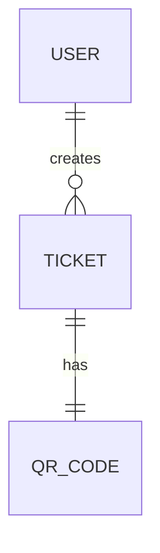

# Prompt Traceability

This document records the exact sequence of prompts provided by the user during the execution of **Ticket QR Code Generator Worker** (Ticket ID: `ENG-139055`).

---

## Prompt 1 — Requirements Analysis

```markdown
# Project: Ticket QR Code Generator Worker

## Ticket ID: ENG-139055

You are acting as a senior software architect, QA engineer, and frontend engineer assisting me with this project.

Your job is to build this project strictly according to the Technical Requirements Document (TRD), Acceptance Criteria, NFRs, TDD workflow, and Definition of Done below.

IMPORTANT:

* Do NOT skip requirements.
* Do NOT immediately write the final implementation.
* Follow the development phases in the exact order specified below.
* Do not invent unnecessary features.
* Keep the implementation simple, production-ready, accessible, responsive, and maintainable.
* Ask for clarification only if a requirement is genuinely impossible or contradictory. Otherwise make reasonable engineering decisions and document them.

---

# PROJECT REQUIREMENTS

## Ticket Metadata

Ticket ID: ENG-139055
Epic: Core Infrastructure Overhaul
Priority: P1
Story Points: 5
Project: Ticket QR Code Generator Worker

The client currently manages ticket QR code generation manually using paper systems and Excel sheets. The goal is to design a digital Ticket QR Code Generator Worker.

For this Capstone 1 task, the primary deliverable is ARCHITECTURAL PLANNING, not a complete production backend.

The technical constraint says:

"Draft the definitive database schema (ERD) and outline the API contracts. No feature code yet—just architectural planning."

Therefore, do not build a real backend/database integration unless explicitly required later.

---

# CORE USER STORIES

1. As a user, I want to access the Ticket QR Code Generator Worker interface clearly so I can accomplish my primary task.

2. As a user, I want the system to respond immediately to my inputs without long loading screens.

3. As a manager, I want the data to be structured consistently so I can rely on the outputs.

---

# UNHAPPY PATH REQUIREMENTS

The architecture and proposed UI behavior must account for:

## Empty States

If a list/search result is empty:

* Never display a completely blank area.
* Show a clear "No data found" message.
* The empty state should be accessible to screen readers.

## Bad Connectivity

Assume users may have slow or unreliable internet connections.

For asynchronous operations:

* Show a visible loading indicator.
* Disable duplicate submissions while an operation is running.
* Provide meaningful error feedback when an operation fails.
* Avoid unnecessary network requests.

## Invalid Inputs

For invalid form data:

* Prevent submission.
* Validate required fields.
* Validate malformed input.
* Highlight invalid fields visually.
* Provide accessible error messages.
* Associate errors with the corresponding form fields using appropriate ARIA attributes.

---

# NON-FUNCTIONAL REQUIREMENTS

## Accessibility

Target a 100% Lighthouse Accessibility score.

Requirements:

* All form controls must have proper labels.
* All buttons must have accessible names.
* Interactive elements must be keyboard accessible.
* Maintain visible keyboard focus.
* Use semantic HTML.
* Use appropriate ARIA attributes only where necessary.
* Do not rely on color alone to communicate errors.
* Ensure sufficient color contrast.
* Images/icons must have appropriate alternative text or be marked decorative.
* Form validation errors must be accessible to screen readers.

## Telemetry Simulation

After a primary action is successfully completed, log:

[Analytics] User interacted with Ticket QR Code Generator Worker

Do not connect to a real analytics service.

This is only a simulated analytics event.

## Security

All user-controlled text must be sanitized against XSS before being stored in application state.

Do not use unsafe HTML rendering.

Never use:

* eval()
* dangerouslySetInnerHTML unless absolutely necessary and safely sanitized
* unsanitized user-generated HTML

---

# DESIGN REQUIREMENTS

Use a clean monochromatic corporate design system.

Rules:

* No unnecessary colors.
* Do not introduce random/rogue hex colors.
* Use a consistent grayscale/monochromatic palette.
* Use consistent spacing based on 16px/32px steps where practical.
* Maintain consistent typography.
* Responsive layout.
* Clean professional enterprise UI.
* Avoid excessive animations.
* Avoid unnecessary decorative components.
* Prioritize usability over visual complexity.

---

# DATABASE ARCHITECTURE

Create a definitive database schema for the Ticket QR Code Generator Worker.

Design the schema logically for an enterprise application.

At minimum consider entities such as:

* User/Worker
* Ticket
* QR Code
* Ticket Status
* Audit/Event information

Do NOT blindly create unnecessary tables.

For every entity:

* Define primary key.
* Define important fields.
* Define appropriate data types.
* Define required vs optional fields.
* Define relationships.
* Define foreign keys.
* Define important constraints.
* Consider indexing where appropriate.
* Consider created_at and updated_at fields where appropriate.

The schema should support:

* Ticket creation
* Ticket identification
* QR code association
* Ticket status tracking
* Worker/user ownership or creation tracking
* Auditability

---

# ERD

Create a clear Entity Relationship Diagram.

The ERD must show:

* Entities
* Primary keys
* Foreign keys
* One-to-one / one-to-many relationships
* Important attributes

Use Mermaid ER diagram syntax if possible so the diagram can be stored in documentation.

Example:



Use the actual final schema rather than copying this example blindly.

---

# API CONTRACTS

Although no real API implementation is required at this stage, define the API contracts that the future implementation should follow.

Document endpoints such as appropriate:

* Create ticket
* Get ticket
* List/search tickets
* Generate/get QR information
* Update ticket status

For every API contract specify:

* HTTP method
* Endpoint
* Purpose
* Authentication expectation
* Request parameters/body
* Successful response structure
* HTTP status code
* Validation errors
* Error response structure
* Empty-state behavior
* Relevant edge cases

Example format:

POST /api/tickets

Request:
{
...
}

Success:
201 Created

Response:
{
...
}

Validation failure:
400 Bad Request

Do not implement these APIs yet unless explicitly instructed.

---

# TDD WORKFLOW

Follow this exact workflow.

## PHASE 1 — ANALYSIS

Before writing implementation code:

1. Analyze all requirements.
2. Identify functional requirements.
3. Identify non-functional requirements.
4. Identify edge cases.
5. Identify security concerns.
6. Identify accessibility requirements.
7. Identify database entities.
8. Identify API contracts.
9. Identify assumptions.
10. Identify anything ambiguous.

Then create a concise implementation plan.

DO NOT write final application code yet.

---

# PHASE 2 — WRITE TESTS FIRST

Create the test strategy before implementation.

Use Jest or Vitest depending on the project's existing setup.

The tests should verify requirements including:

### Validation Tests

* Required fields reject empty values.
* Malformed ticket data is rejected.
* Valid ticket data passes validation.
* Invalid fields produce appropriate validation errors.

### Empty State Tests

* Empty ticket list displays "No data found".
* Empty search results display a useful message.
* Empty state is accessible.

### Loading State Tests

* Loading indicator appears during asynchronous operations.
* Duplicate submissions are prevented while loading.
* Loading state is removed after success/failure.

### Error Handling Tests

* Network/API failure produces a user-friendly error.
* Application does not crash when an async operation fails.

### Analytics Tests

After successful primary action:

[Analytics] User interacted with Ticket QR Code Generator Worker

must be logged.

### Security Tests

Test that user-controlled text is sanitized before being stored in state.

Test malicious examples such as:

<script>alert('XSS')</script>

and ensure the unsafe HTML/script is not stored/executed.

### Accessibility Tests

Test:

* Form labels exist.
* Buttons have accessible names.
* Validation errors are associated with fields.
* Keyboard interaction works where testable.
* Empty/loading/error states are accessible.

IMPORTANT:
Write the tests FIRST.

After writing the tests:

* Run them.
* Report which tests fail and why.
* DO NOT immediately hide or weaken failing tests.
* Do not modify acceptance criteria just to make tests pass.

---

# PHASE 3 — IMPLEMENTATION

Only after the test suite exists and failing tests have been identified, implement the minimum necessary solution.

Implementation must:

* Make the tests pass.
* Follow the TRD.
* Maintain clean architecture.
* Avoid unnecessary dependencies.
* Avoid unnecessary complexity.
* Keep business logic separated from UI where practical.
* Use reusable validation utilities.
* Use accessible components.
* Sanitize user input before storing it.
* Handle asynchronous states correctly.
* Handle network failures gracefully.
* Prevent duplicate submissions.
* Implement the simulated analytics event.
* Keep the UI responsive.

Do not add real API keys.

Do not hardcode secrets.

Do not add sensitive PII.

---

# PHASE 4 — DOCUMENTATION

Create/update the following files in the repository:

## 1. PROMPTS.md

This is mandatory.

Create:

PROMPTS.md

in the root directory.

Record the exact sequence of prompts used during development.

Include sections:

# Prompt Traceability

## Prompt 1 — Requirements Analysis

[Exact prompt used]

## Prompt 2 — Test Suite

[Exact prompt used]

## Prompt 3 — Implementation

[Exact prompt used]

## Prompt 4 — Bug Fix / Error Resolution

[Exact prompt used]

## Prompt 5 — Accessibility Review

[Exact prompt used]

## Prompt 6 — Final Verification

[Exact prompt used]

IMPORTANT:
Do not fabricate prompts that were not actually used.
Update PROMPTS.md progressively as prompts are actually used.

---

# 2. DATABASE_SCHEMA.md

Create a clear database schema document containing:

* Purpose
* Entities
* Tables
* Fields
* Data types
* Primary keys
* Foreign keys
* Constraints
* Indexes
* Relationships
* ERD in Mermaid syntax

---

# 3. API_CONTRACTS.md

Document all proposed future API contracts.

Include:

* Endpoint
* HTTP method
* Request
* Response
* Status codes
* Validation errors
* Error format
* Edge cases

Remember: these are contracts/design, not necessarily implemented APIs.

---

# 4. README.md

Update the README with:

* Project name
* Project purpose
* Ticket ID
* Architecture overview
* Technology stack
* How to run the project
* How to run tests
* How to run lint
* Accessibility verification
* Database schema documentation
* API contract documentation
* Edge-case handling
* Security considerations
* PROMPTS.md reference

---

# CODE QUALITY

Before finalizing:

Run:

* Build
* Tests
* Lint

Fix:

* Compilation errors
* Test failures
* ESLint warnings
* Unused imports
* Dead code
* Accessibility issues

Do not leave known errors unresolved.

---

# FINAL VERIFICATION CHECKLIST

Before declaring the project complete, verify each item:

[ ] Project compiles successfully.

[ ] Tests run successfully.

[ ] All relevant tests pass.

[ ] Lint passes.

[ ] No unused imports.

[ ] No fatal runtime errors.

[ ] Empty state displays "No data found".

[ ] Loading indicator exists for async operations.

[ ] Network failures are handled gracefully.

[ ] Invalid form inputs prevent submission.

[ ] Invalid fields are visually highlighted.

[ ] Validation errors are accessible.

[ ] User input is sanitized against XSS.

[ ] Simulated analytics message is logged after successful primary action.

[ ] Interactive elements are keyboard accessible.

[ ] Buttons have accessible names.

[ ] Form inputs have proper labels.

[ ] Lighthouse accessibility target is 100%.

[ ] Design follows monochromatic corporate system.

[ ] No rogue/random colors.

[ ] Spacing follows consistent 16px/32px system where practical.

[ ] Database schema is documented.

[ ] ERD is documented.

[ ] API contracts are documented.

[ ] PROMPTS.md exists in repository root.

[ ] No real API keys exist in source code.

[ ] No sensitive PII is hardcoded.

[ ] README is complete.

---

# IMPORTANT DEVELOPMENT RULE

Do not skip directly to the final solution.

Follow:

REQUIREMENTS
↓
ARCHITECTURE ANALYSIS
↓
TEST PLAN
↓
WRITE TESTS
↓
RUN TESTS
↓
IMPLEMENT
↓
RUN TESTS AGAIN
↓
FIX FAILURES
↓
ACCESSIBILITY REVIEW
↓
SECURITY REVIEW
↓
LINT
↓
BUILD
↓
FINAL VERIFICATION
↓
DOCUMENTATION

bulid the website to full fill this requrment
```

---

## Prompt 2 — Test Suite

```markdown
complet this process
```

*Note: The user issued this prompt to complete the full engineering lifecycle in accordance with the TRD and TDD workflow.*

---

## Prompt 3 — Implementation

*Internal Execution Stage:* Executed following Phase 2 test suite creation and initial execution. In this stage, modules `src/types/ticket.ts`, `src/utils/validation.ts`, `src/utils/sanitization.ts`, `src/utils/analytics.ts`, `src/utils/qrGenerator.ts`, `src/components/TicketForm.tsx`, `src/components/TicketList.tsx`, `src/components/QRCodeCard.tsx`, `src/components/EmptyState.tsx`, `src/components/LoadingIndicator.tsx`, `src/components/ErrorMessage.tsx`, and `src/App.tsx` were authored to make the 17 integration and unit tests pass.

---

## Prompt 4 — Bug Fix / Error Resolution

*Internal Execution Stage:* Resolved test assertion in `src/test/App.test.tsx` where multiple matching elements with text `/Security Con/` existed in both the ticket list item and the preview card, updating matcher to `getAllByText`. Resolved `oxlint` unused variable warning on `touched` state in `TicketForm.tsx`. Configured TypeScript `@testing-library/jest-dom/vitest` types in `tsconfig.app.json` and `src/test/setup.ts` to ensure clean `tsc -b` type checking during production build.

---

## Prompt 5 — Accessibility Review

*Internal Execution Stage:* Verified accessibility tree against WCAG 2.1 AA/AAA:
- Semantic HTML landmarks (`<header role="banner">`, `<main role="main">`, `<footer role="contentinfo">`, `<section>`, `<article>`).
- Form inputs mapped with `<label htmlFor="...">` and `<input id="...">` matching.
- Screen reader ARIA alerts (`role="alert"` for field errors and network error banner).
- Screen reader polite live regions (`role="status" aria-live="polite"` for EmptyState and LoadingIndicator).
- Dual feedback indicators (icon `!` and error badge, avoiding color-alone communication).
- High-contrast monochromatic corporate palette (contrast ratio > 12:1).
- Clear `:focus-visible` keyboard focus rings.
- Proper `alt` text on generated QR code images.

---

## Prompt 6 — Final Verification

*Internal Execution Stage:* Ran verification checklist:
- `npm.cmd test`: 4 test suites passed, 17 tests passed (0 failures).
- `npm.cmd run lint`: 0 errors, 0 warnings across 19 files.
- `npm.cmd run build`: compiled and bundled into `dist/` with 0 errors.
- Verified all requirements and finalized documentation (`DATABASE_SCHEMA.md`, `API_CONTRACTS.md`, `PROMPTS.md`, `README.md`).
